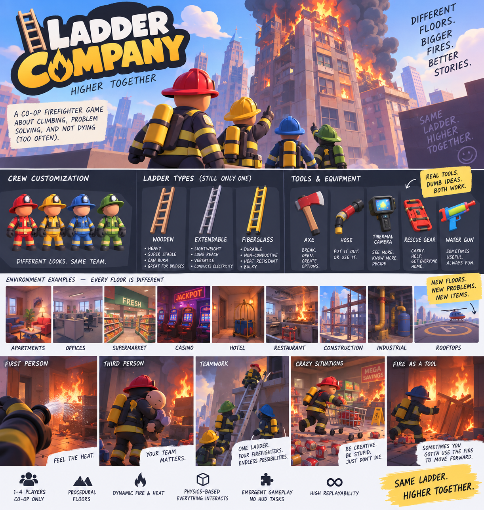

# LADDER COMPANY
## GAME DESIGN BIBLE v0.1

**HIGHER TOGETHER.**  
*Creative source of truth • September 2026*

---

## 01 — Game Vision

Ladder Company is a 2–4 player cooperative, physics-driven firefighter game about climbing an enormous, unpredictable burning building with friends.

The shorthand is “PEAK meets firefighting,” but Ladder Company is not a clone. Its identity comes from firefighting, vertical traversal, one shared physical ladder, systemic fire, environmental problem solving, and emergent co-op comedy.

The goal is not to complete a checklist of firefighter missions. The goal is to survive, solve problems, keep moving upward, and see how high the team can get.

## 02 — Core Fantasy

The player fantasy is: “Four firefighters trying to climb an enormous burning building together while using whatever they can find to survive.”

Players should feel like a small crew operating inside a huge, unstable disaster. They communicate, improvise, make mistakes, rescue people, manipulate the environment, and occasionally make the situation dramatically worse.

## 03 — Design Pillars

**ONE SHARED LADDER** — The team has one primary physical ladder. It is a central gameplay object, not an ability or inventory icon.

**FIRE IS SYSTEMIC** — Fire spreads, consumes fuel, produces heat and smoke, reacts to ventilation, and interacts with objects and structure.

**FIRE IS ALSO A RESOURCE** — Sometimes the correct move is to deliberately use fire to destroy, clear, heat, illuminate, or otherwise manipulate the environment before regaining control.

**ENVIRONMENTAL PROBLEM SOLVING** — The game shows players a situation rather than a task list. Players interpret what happened and decide what to do.

**EMERGENT CO-OP** — Physics, communication, mistakes, and teamwork create memorable situations that are not fully scripted.

**EVERYTHING SHOULD FEEL PHYSICAL** — Whenever practical, important objects should be carried, thrown, pushed, pulled, damaged, blocked, burned, or otherwise affected by the shared world.

**READABLE STYLIZATION** — The visual style is colorful, chunky, expressive, and readable, with dramatic fire and environments that are easy to understand at a glance.

## 04 — Player Experience

The desired rhythm is: enter a new situation → understand the danger → discuss a plan → physically manipulate the environment → improvise when the plan goes wrong → regain control → find the way upward.

The ideal player reaction is not “I completed the objective.” It is “I cannot believe that worked,” “Why did you do that?”, or “How the hell are we getting that ladder back?”

## 05 — The One-Ladder Philosophy

The team receives ONE primary ladder. Four players do not each have a ladder.

The ladder is a shared physical object. Players carry, rotate, drop, position, lean, extend, stabilize, retrieve, and climb it.

The ladder can be used for vertical climbing, reaching windows and balconies, bridging broken floors, crossing gaps, reaching neighboring structures, navigating collapsed stairs, and potentially acting as an improvised lever or reach tool.

The awkwardness is intentional. The ladder should create communication and physical comedy without becoming needlessly frustrating.

Losing the ladder should create a major problem, not necessarily an automatic run failure. The team may have to improvise, search for alternatives, or live with the consequences.

## 06 — Ladder Types

Different ladder types should be meaningful physical tools rather than simple rarity upgrades.

**WOODEN** — Heavy, very stable, strong as a bridge, cumbersome, and flammable. Its condition can visibly deteriorate through charring, cracking, and burning.

**ALUMINUM EXTENSION** — Lightweight, long reach, compact when collapsed, versatile, potentially unstable when extended, and electrically conductive.

**FIBERGLASS** — Durable, bulky/heavy, heat resistant, and non-conductive. Especially valuable around electrical hazards.

The core rule remains: the team still gets only ONE primary ladder.

## 07 — Fire System Philosophy

Fire is not a static enemy or a simple health bar. It is an evolving environmental system.

Fire should interact with fuel, heat, oxygen/ventilation, water, rooms, doors, windows, electrical systems, structural materials, and players.

Heat can affect movement, stamina, vision, equipment handling, and survival. Heat should be communicated through environmental feedback such as smoke, distortion, glowing materials, sound, and changing fire behavior.

Players should sometimes make a fire temporarily worse because doing so creates a better path forward. The challenge is controlling the consequences afterward.

## 08 — Fire as a Resource

The game is about putting fires out, but the player is not always rewarded for immediately extinguishing every flame.

Potential uses include burning through wooden obstructions, destroying unwanted structures, triggering heat-sensitive mechanisms, providing temporary light, or deliberately consuming fuel to change an environment.

The key design question is: “Can we use the fire without letting the fire use us?”

The game should not explicitly label these solutions. Players discover them through experimentation and observation.

## 09 — Fuel & “Bad Idea” Items

The world contains objects with different relationships to fire. Not every object needs to display a “flammable” label.

**LOW FUEL** — Paper, playing cards, newspapers, receipts, napkins, cardboard.

**MEDIUM FUEL** — Curtains, clothing, furniture, mattresses, carpets, wooden pallets.

**HIGH / DANGEROUS FUEL** — Cooking oil, propane, certain chemicals, large plastic storage, aerosol-type objects.

**NON-COMBUSTIBLE CONTRAST** — Metal, glass, concrete, ceramic, and water.

Casino chips are a perfect example: they can be physically picked up and thrown, but do basically nothing. Playing cards can actually become fuel. The player learns the difference through experimentation.

## 10 — Environmental Problem Solving / No-HUD Philosophy

The game should not constantly tell players what to do.

Avoid traditional objective lists, “Rescue 2 civilians” trackers, waypoints, constant destination markers, and intrusive objective-complete messaging.

A floor should communicate its problem through the environment: fire, smoke, a trapped civilian, a collapsed floor, a broken valve, a water source, an inaccessible balcony, damaged infrastructure, or a dangerous route.

Minimal HUD may communicate genuinely useful player state such as heat, air, water pressure, or teammate information, but the world itself should remain the primary source of information.

The desired first reaction when entering a new floor is: “What the fuck happened here?”

## 11 — Ventilation, Doors & Windows

Ventilation is a meaningful environmental system.

Opening or breaking a window may improve visibility and remove smoke, but can introduce oxygen and dramatically intensify a fire.

Doors and windows can change airflow and therefore change how smoke and fire behave.

Players should learn these relationships through consequences rather than pop-up tutorials.

## 12 — Hose & Water Infrastructure

Water is not an infinite resource. The team must connect the hose to building water sources as it climbs.

Possible sources include standpipes, fire department hookups, water tanks, valves, stairwell connections, and damaged building infrastructure.

Water pressure can be simplified into weak, normal, and excessive states. Excessive pressure makes the hose harder to control.

The hose is physical: it can snag, tangle, wrap around objects, pull players, and require teamwork between the nozzle operator and the player managing the hose.

The ladder gets people where they need to go. The hose gets water there. Both are shared logistical systems.

## 13 — Equipment Philosophy

The equipment pool is “real firefighter tools + stupid fun toys.”

**ESSENTIAL** — Fire axe, Halligan, flashlight, radio.

**UTILITY** — Thermal camera, portable extinguisher, rescue saw, repair kit.

**TEAM / TRAVERSAL** — Rope, harness, ladder-related equipment.

**FUN / DUMB** — Water gun, bucket, garden hose, shopping cart, furniture, casino chips, teddy bears, pizza boxes, and other environmental objects.

Silly objects should have some possible gameplay use when practical, but they do not need to be powerful or important. Some can simply create opportunities for experimentation and comedy.

## 14 — Consequences & Emergent Comedy

The funniest moments should come from systems interacting, not scripted jokes.

Examples: an axe hits the wrong pipe and creates a flood; a Halligan opens the wrong door and causes a heat surge; water reaches electrical equipment and creates a new hazard; a shopping cart rolls away with equipment; a hose catches on something and pulls a teammate backward; a player throws an aerosol-type object toward a fire and creates a chain reaction.

Players should be allowed to try physically plausible stupid ideas. The game should not constantly prevent them from experimenting.

## 15 — Floor & Building Structure

The building is ONE continuous run. Floors feel like mini-levels inside a larger climb, but there is no menu between floors.

The team moves physically from one floor to the next through stairwells, elevator shafts, collapsed ceilings, exterior ledges, windows, ladders, damaged structures, or other connected routes.

A floor may take roughly 5–15 minutes depending on complexity, but there is no requirement that players receive a “floor complete” screen.

The run ends when the team fails and returns to the menu. Best floor reached becomes part of the replay loop.

Consequences can persist: used water, damaged equipment, ladder position, unresolved fire, altered ventilation, and other world state can affect later parts of the run.

## 16 — Crazy Floors & Environmental Variety

The building should contain wildly different environments. These are not merely visual skins; their contents and geometry should change the way players solve problems.

Examples: apartments, offices, hotels, supermarkets, casinos, restaurants, hospitals, schools, construction sites, industrial floors, parking garages, pools, arcades, nightclubs, aquariums, rooftops, and exterior building sections.

**SUPERMARKET** — Shopping carts, cardboard, shelving, freezers, loading areas, packaging, food, and huge fuel potential.

**CASINO** — Slot machines, playing cards, chips, neon, security areas, chandeliers, electrical hazards, and lots of opportunities for dumb interactions.

**RESTAURANT** — Cooking equipment, grease/oil hazards, kitchen ventilation, propane, cramped routes, and wet surfaces.

**CONSTRUCTION** — Open edges, temporary platforms, beams, scaffolding, incomplete floors, and major traversal gaps.

**INDUSTRIAL** — Pipes, tanks, machinery, valves, water infrastructure, electrical systems, and large spaces.

**ROOFTOPS / EXTERIOR** — Wind, exterior routes, neighboring buildings, huge gaps, helicopters, and dramatic consequences.

Some floors should be intentionally bizarre. The building itself can be absurd and unexplained.

## 17 — Difficulty & Progression

Difficulty should increase by introducing and combining systems rather than simply inflating enemy or fire statistics.

**Early:** small fires, basic traversal, learning the ladder.

**Middle:** smoke, heat zones, larger fires, water management, ventilation decisions.

**Later:** structural damage, collapsing traversal, exterior routes, explosions, severe heat/smoke, and multiple systems interacting at once.

High floors should feel increasingly chaotic, but the underlying rules should remain learnable.

## 18 — Multiplayer Philosophy

The game is designed around 2–4 players cooperating in the same physical space.

Important shared systems must behave consistently for every player: ladder state, hose state, fire, water, doors, windows, physics interactions, equipment, civilians, and world changes.

Multiplayer should be considered from the beginning rather than bolted on later.

## 19 — Visual Identity

The current visual direction is stylized 3D cartoon rather than gritty realism.

**CHARACTERS** — Chunky proportions, large readable silhouettes, expressive simple faces, oversized equipment, colorful helmets and suits.

**GEOMETRY** — Simplified, rounded, chunky forms with clean silhouettes.

**MATERIALS** — Stylized PBR with limited surface detail and matte/satin finishes.

**ENVIRONMENTS** — Recognizable props, readable architecture, controlled clutter, strong silhouettes, and distinct visual identities for different floor types.

**FIRE / SMOKE** — Dramatic, stylized, thick, readable, and strongly integrated with lighting and environmental feedback.

The visual identity should feel like its own game. PEAK may be a gameplay-feel reference, but its art style should not be copied.

## 20 — What Ladder Company Is NOT

Not a hardcore firefighter simulator.

Not a traditional mission game built around objective checklists.

Not a loot-heavy RPG where better stats are the main reward.

Not a scripted comedy game.

Not a collection of disconnected floor maps.

Not a PEAK clone.

Not a game where the player is constantly told the correct solution.

Not a game that adds systems simply because they sound cool. New systems should strengthen the core fantasy.

## 21 — Prototype Philosophy

The first development goal is not the full game. It is proving that the core interaction is fun.

**FIRST PROTOTYPE:** two or more firefighters, one physical ladder, one small test building, a few traversal problems, and multiplayer physics.

The ladder prototype should prove: pick up, carry, drop, rotate, position, lean, climb, bridge a gap, interact with multiple players, and remain synchronized in multiplayer.

After the ladder is fun, add fire/heat/smoke/water. Then build more environmental situations. Then build the larger procedural run structure.

The project should be built incrementally and should preserve the design pillars as new systems are added.

## 22 — Future Ideas / Parking Lot

Additional ladder variants, more floor themes, rare “what the hell is this?” floors, deeper fire spread, structural collapse, civilians, exterior traversal, character customization, more equipment, rare fun items, fire-station hub, procedural floor combinations, persistent run consequences, and more systemic environmental interactions.

These ideas are intentionally a parking lot. They are not commitments for the first prototype.

## 23 — Visual Reference

These concept images establish the current visual direction: colorful stylized 3D characters, chunky readable equipment, dramatic fire, varied floors, physics-driven situations, and multiple gameplay perspectives. They are references, not final assets.

### Core style, character, equipment, and environment reference

### Expanded world, ladder, and item-pool reference

### POV and gameplay-moment reference

