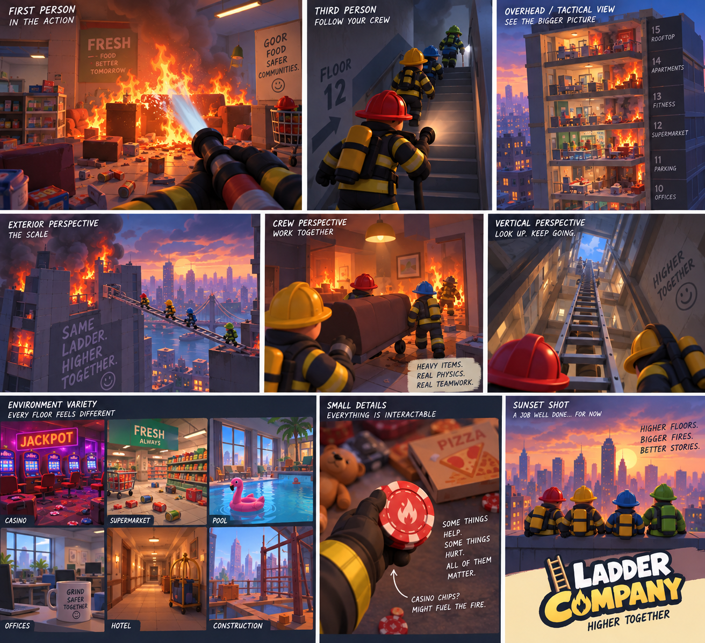
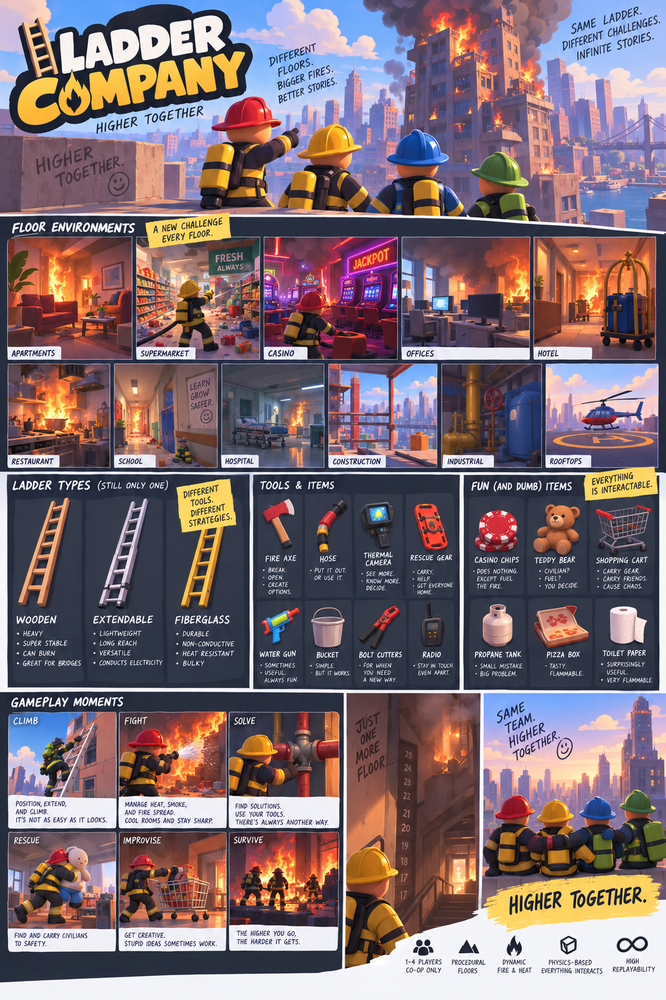

# LADDER COMPANY
## TECHNICAL DEVELOPMENT BRIEF v0.1

**BUILD THE LADDER FIRST.**  
*Technical source of truth • September 2026*

---

## 01 — Purpose

This document translates the Ladder Company Game Design Bible v0.1 into a practical technical development plan.

The immediate goal is not to build the complete game. The immediate goal is to prove that the shared physical ladder is fun in multiplayer.

## 02 — Project Definition

Ladder Company is a 2–4 player cooperative, physics-driven firefighter game built around vertical traversal, systemic fire, environmental problem solving, and emergent comedy.

Primary development target: Windows PC multiplayer.

Recommended engine: Unreal Engine 5.

## 03 — Technology Stack

**UNREAL ENGINE 5** — Primary game engine for player movement, physics, multiplayer, environments, interaction, fire/FX, UI, audio, and packaging.

**C++ + BLUEPRINTS** — Use C++ for durable gameplay foundations, networking-sensitive systems, reusable components, and core data structures. Use Blueprints for rapid iteration, tuning, presentation, and designer-friendly configuration.

**BLENDER** — Modeling, cleanup, pivots, collision, materials, simple rigging, and asset preparation.

**AI 3D TOOLS** — Meshy, Tripo, or similar tools can accelerate concept-to-3D work. AI meshes must be inspected and optimized before production use.

**GIT / GITHUB** — Version control from the beginning.

**CLAUDE CODE** — Primary AI development agent for implementation, repository work, documentation, testing, and automation.

**CHATGPT / CODEX** — Secondary design, architecture, debugging, review, documentation, and targeted development partner.

## 04 — AI Development Model

The human developer is the game director. AI agents are development partners, not autonomous owners of the game's creative direction.

Claude should read the Game Design Bible and this Technical Development Brief before major implementation.

Claude should not introduce major gameplay systems, progression, classes, skill trees, loot systems, objective trackers, monetization, or other large features without approval.

Build in small increments. After meaningful work, report what changed, files touched, how to test it, and known limitations.

Use one primary implementation agent at a time. Do not allow multiple agents to make uncontrolled simultaneous edits to the same Unreal project.

When a decision materially changes gameplay, Claude should present options instead of silently deciding.

## 05 — Repository Structure

Recommended structure:

```text
LadderCompany/
├── LadderCompany.uproject
├── Config/
├── Content/
│   ├── Characters/
│   ├── Equipment/
│   ├── Environment/
│   ├── Floors/
│   ├── Materials/
│   ├── FX/
│   ├── Audio/
│   ├── UI/
│   └── Test/
├── Source/
├── Plugins/
├── Blender/
├── Assets_Source/
├── Concepts/
├── Docs/
│   ├── GAME_DESIGN_BIBLE.md
│   ├── TECHNICAL_DEVELOPMENT_BRIEF.md
│   ├── LADDER_SYSTEM.md
│   ├── MULTIPLAYER.md
│   ├── FIRE_SYSTEM.md
│   └── CHANGELOG.md
└── README.md
```

Keep source/reference assets separate from optimized Unreal assets. Avoid giant catch-all folders.

## 06 — Architecture Principles

**MODULAR** — Systems should have clear responsibilities and minimal unnecessary coupling.

**DATA-DRIVEN** — Values such as ladder mass, length, friction, fire intensity, heat thresholds, and water pressure should be easy to tune.

**MULTIPLAYER-FIRST** — Shared gameplay state must be designed with replication in mind from the beginning.

**SERVER-AUTHORITATIVE WHERE APPROPRIATE** — The server should own important shared state and validate important shared interactions.

**PHYSICS-CONSCIOUS** — Physics should be stable and readable for 2–4 players.

**DEBUGGABLE** — Important systems should expose developer debug information even if the final game hides it.

**NO PREMATURE COMPLEXITY** — Build the simplest version that proves a mechanic before adding advanced simulation.

## 07 — Multiplayer

The game is designed around 2–4 players from the start; multiplayer is not a later conversion.

Important shared state includes player presence, ladder state, physics state, interactions, fire, water, doors, windows, equipment, civilians, and major world changes.

Do not replicate every visual detail. Replicate authoritative gameplay state and derive cosmetic presentation locally where practical.

The first multiplayer test must allow two players to see each other, move in the same test room, manipulate the same ladder, and observe consistent ladder behavior.

## 08 — Interaction System

Create a reusable interaction framework rather than hard-coding interactions into individual objects.

Support concepts such as target/look, interact, hold/drag, pickup, drop, use, climb, and contextual manipulation.

Important interactions should feel physical. Avoid turning the ladder into a magical snap-to-place object.

For the first prototype, prioritize reliable interaction over a complex inventory system.

## 09 — Ladder System

The ladder is the flagship prototype system.

Suggested conceptual pieces: Ladder Actor, ladder physics/state component, carry/manipulation component, climb component, interaction interface, and multiplayer replication layer.

Prototype functions: pickup/carry, drop, rotate, position, lean, stabilize, climb, bridge a gap, and recover after being knocked over.

Do not build every ladder type initially. Prototype one ladder, then create data-driven configurations for wooden, aluminum extension, and fiberglass variants.

Configurable properties can include length, mass, collision shape, center of mass, friction, handling behavior, extension state, heat tolerance, and condition/damage.

The physical world object is the source of truth; the ladder is not an inventory icon.

## 10 — Player Prototype

Start with a simple first-person firefighter.

Required movement: walk, look, jump, sprint, basic collision, and multiplayer replication.

Required interaction: target an object, interact, pick up/drop the ladder, and climb.

Do not spend early development time on detailed character customization, cosmetics, advanced animation, or progression.

## 11 — Test Building

Build an intentionally ugly but functional blockout.

Include a starting room, hallway, vertical connection, broken stair area, large gap, window/balcony, and upper floor.

The map exists to test the ladder from different angles and situations. Art polish comes later.

## 12 — Physics Strategy

Physics should create comedy and possibility without becoming uncontrollable.

Use stable collision primitives and sensible mass values before detailed collision meshes.

Important objects need intentional pivots and centers of mass.

Test player-to-ladder, ladder-to-environment, sliding, falling, and multi-player manipulation.

Prefer predictable game feel over physically perfect simulation if perfect simulation is frustrating.

Add controlled constraints or assistive behavior only when needed to preserve playability while keeping the object physical.

## 13 — Fire / Heat / Smoke

Do not build the full fire system during the first ladder prototype.

Build in stages: basic flame state → fuel → spread → heat → smoke → ventilation → water/extinguishing → structural consequences.

Separate gameplay fire state from visual effects. Gameplay state should drive Niagara/visual presentation rather than the reverse.

Eventually fire should consume fuel, change intensity, spread under defined conditions, react to airflow, create heat/smoke, and respond to water.

Heat should have gameplay thresholds while smoke, distortion, sound, and materials communicate those states.

## 14 — Hose / Water

Implement water after the core fire prototype.

Separate water availability, pressure, flow, hose state, nozzle behavior, and extinguishing logic.

The hose should eventually be physical enough to snag, tangle, wrap, pull players, and require teamwork.

Start with weak / normal / excessive pressure rather than a complete hydraulic simulation.

## 15 — Procedural Floors

Procedural generation comes after core physical systems work.

Generate situations, not just random rooms.

A floor can be modeled as: environment theme + structural condition + fire situation + resource situation + traversal problem + optional civilian/event + available objects.

Examples: supermarket + kitchen fire + collapsed aisle + broken water source; casino + electrical fire + smoke + security barrier; construction + missing floor + exterior route + limited water.

Generated floors must remain readable and solvable without objective markers.

## 16 — Asset Pipeline

Concept → reference image → AI 3D generation or Blender modeling → cleanup → scale/pivots/collision → materials → Unreal import → gameplay test → optimization → production asset.

Important physics objects such as the primary ladder should use controlled Blender modeling or heavily cleaned AI output because dimensions, collision, pivot placement, and physical behavior matter.

Inspect AI assets for bad topology, excessive polygons, broken UVs, disconnected geometry, inconsistent scale, and poor rigging.

Favor readable silhouettes and simple materials before high-detail assets.

## 17 — Source Control

Create Git/GitHub before substantial development.

Commit small, meaningful changes with descriptive messages.

Do not commit caches, generated build artifacts, or unnecessary temporary files.

Create a rollback point before major structural changes.

Claude should not delete or rewrite large project areas without explaining the change first.

Maintain CHANGELOG.md for major milestones and architectural decisions.

## 18 — Testing

Every milestone should have a reproducible test scenario.

Example: two players load the ladder test map, carry the ladder to a gap, place it across the gap, climb across, knock it down, recover it, and repeat.

Test multiplayer early and often.

Developer debug tools can expose interaction traces, ladder state, physics state, network authority, and fire state.

The ultimate test is player feel: is the mechanic fun?

## 19 — Development Milestones

**PHASE 0 — Project foundation:** Unreal project, Git, source structure, documentation, build/run workflow.

**PHASE 1 — Player:** first-person movement, camera, interaction, multiplayer presence.

**PHASE 2 — Ladder:** pickup, carry, drop, rotate, position, lean, climb, bridge a gap, synchronization.

**PHASE 3 — Physics:** player/object collisions, ladder instability, environmental interaction, recovery.

**PHASE 4 — Fire prototype:** fire, fuel, extinguishing, heat, smoke.

**PHASE 5 — Building systems:** doors, windows, ventilation, broken floors, water source.

**PHASE 6 — Hose/water:** physical hose, pressure, flow, water logistics.

**PHASE 7 — Handcrafted floor situations** demonstrating systemic combinations.

**PHASE 8 — Procedural run:** connected floors, escalation, persistence, failure, best-floor tracking.

**PHASE 9 — Content/polish:** art, animation, audio, equipment, environments, characters, UI, optimization.

## 20 — First Prototype Definition of Done

Two to four players can enter a simple test building and physically manipulate one ladder together.

The ladder can be carried, dropped, positioned, leaned, climbed, recovered, and used to cross a meaningful gap.

Players can interfere with one another physically without making the system unusable.

The ladder remains sufficiently consistent across multiplayer clients.

The prototype produces unscripted moments where players laugh, argue, or improvise.

Visual polish is not required.

## 21 — Rules for Claude Code

Read Docs/Game Design Bible and Docs/Technical Development Brief before implementing major systems.

Do not add unapproved major systems.

Build small increments and test each increment.

Keep multiplayer in mind from the beginning.

Prefer reusable components/interfaces over one-off hard-coded logic.

Separate gameplay logic from presentation where practical.

Document important architecture decisions.

After meaningful work, report changed files, implementation summary, test procedure, and known issues.

Never claim a feature is complete without actually building/testing it to the extent available.

## 22 — First Build Order

1. Create Unreal project and Git repository.
2. Establish folder structure and documentation.
3. Create basic multiplayer player.
4. Create reusable interaction system.
5. Create blockout test building.
6. Create first physical ladder.
7. Implement pickup/carry/drop.
8. Implement positioning/leaning/rotation.
9. Implement climbing.
10. Implement gap-crossing test.
11. Test with multiple players.
12. Tune physical feel before adding fire.

Only after this proves fun should development expand into fire, heat, smoke, water, crazy floors, and the larger run.

## 23 — Immediate Success Question

“Is four-player cooperation around ONE physical ladder genuinely fun?”

If yes, Ladder Company has a strong mechanical foundation. Everything else should build outward from that experience.

## 24 — Visual Reference

Current concept art is included as technical/art-direction context for character proportions, equipment readability, floor variety, lighting, and gameplay perspectives. These are references, not final production assets.

### POV and gameplay-moment reference



### World, ladder, equipment, and item-pool reference


